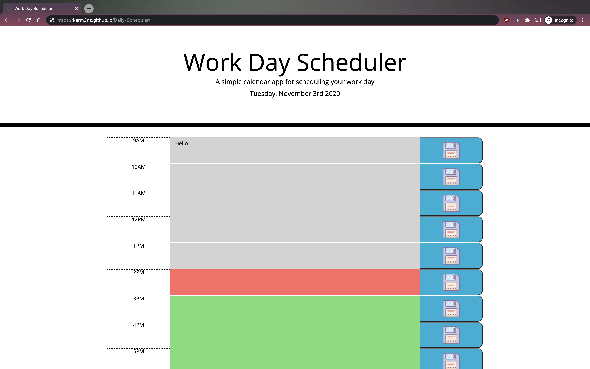

# Day Scheduler

## Description 

From personal use, to business use, to educational use, a productive day starts with a plan. In order to get the most out of the day, planning out an idea of what the day looks like at they start of the say, sets our users up for success to acheive daily goals! 

Features of the web application Day Schduler includes: displaying the current date in the header, displaying hour "blocks" from 9am to 5pm, inputting schedules in respecting hour blocks, colour-coding of hour blocks (to reflect whether the schedule in the past, present, or future), and allowing users to save their schedule to local storage. 

In this project, I had difficulties with making sure that the "present" colour-code was showing up, as well as figuring out what "this" in the code was referring to in various scenarios. It took numerous console logging in various places, trial and error, looking up functions to become more familiar with the "how" and the "why" aspect of why the code works. From this project, the most valuable piece of information I learned is how "this" makes it so much easier to navigate around the HTML file and grab ids/classes.

## Table of Contents

* [Installation](#installation)
* [Usage](#usage)
* [Credits](#credits)
* [License](#license)

## Installation

1) Make sure to have properly functioning computer.
2) Check if an internet browswer is installed. If so, go to step 4).
3) Install an internet browser of your choice. 
4) Open up internet web browser.
5) In the address bar, type in :  https://karm3nz.github.io/Daily-Scheduler/ and hit "enter" on the keyboard.

## Usage 

To arrive at the Daily Scheduler web application, type in :  https://karm3nz.github.io/Daily-Scheduler/ on the address bar on the web browser and hit the "enter" key. 

Here we see that listed down the page are the time blocks for each hour with corresponding area for the user to input their schedule data. The user can plan their day by clicking the input textbox next to the corresponding hour (that the schedule is to be scheduled), and typing on the keyboard its description. Afterwards click the corresponding "save" button (with the floppy disk icon) to save the schedule input. Should user need to change saved schedule data, user can once again click the very input textbox to edit/correct the schedule, and click the save button to overwrite prior saved schedule.

## Credits

### Links to Tutorials/References Reffered to on Project:

References:
https://github.com/lbmoody/simple-day-planner
https://github.com/wdvaughn/day-planner

Save Icon:
https://icons8.com/icons/set/save

Extracting current "hour" from moment() :
https://stackoverflow.com/questions/27978819/extract-time-from-moment-js-object
https://github.com/lbmoody/simple-day-planner
https://flaviocopes.com/momentjs/

Getting the current date/time:
https://momentjs.com/

## License

MIT License

Copyright (c) [2020] [Carmen Hui]

Permission is hereby granted, free of charge, to any person obtaining a copy
of this software and associated documentation files (the "Software"), to deal
in the Software without restriction, including without limitation the rights
to use, copy, modify, merge, publish, distribute, sublicense, and/or sell
copies of the Software, and to permit persons to whom the Software is
furnished to do so, subject to the following conditions:

The above copyright notice and this permission notice shall be included in all
copies or substantial portions of the Software.

THE SOFTWARE IS PROVIDED "AS IS", WITHOUT WARRANTY OF ANY KIND, EXPRESS OR
IMPLIED, INCLUDING BUT NOT LIMITED TO THE WARRANTIES OF MERCHANTABILITY,
FITNESS FOR A PARTICULAR PURPOSE AND NONINFRINGEMENT. IN NO EVENT SHALL THE
AUTHORS OR COPYRIGHT HOLDERS BE LIABLE FOR ANY CLAIM, DAMAGES OR OTHER
LIABILITY, WHETHER IN AN ACTION OF CONTRACT, TORT OR OTHERWISE, ARISING FROM,
OUT OF OR IN CONNECTION WITH THE SOFTWARE OR THE USE OR OTHER DEALINGS IN THE
SOFTWARE.